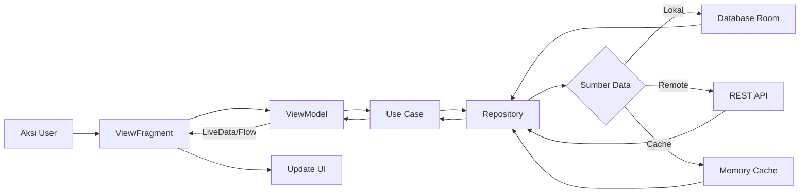

# Iamra Course - Aplikasi Pembelajaran Online

<div align="center">


**Aplikasi Learning Management System berbasis Android dengan fitur lengkap untuk Instruktur, Siswa, dan Forum Diskusi**

[Fitur](#-fitur) • [Screenshot](#-screenshot) • [Arsitektur](#-arsitektur) • [Instalasi](#-instalasi) • [Teknologi](#-teknologi)

</div>

---

## 📋 Daftar Isi

- [Tentang Aplikasi](#-tentang-aplikasi)
- [Fitur Lengkap](#-fitur-lengkap)
  - [Fitur Guest](#fitur-guest)
  - [Fitur Member](#fitur-member)
  - [Fitur Instruktur](#fitur-instruktur)
  - [Fitur Siswa](#fitur-siswa)
  - [Fitur Forum](#fitur-forum)
- [Screenshot](#-screenshot)
- [Arsitektur](#-arsitektur)
- [Teknologi](#-teknologi)
- [Cara Instalasi](#-cara-instalasi)
- [Struktur Proyek](#-struktur-proyek)
- [Build & Release](#-build--release)
- [Kontribusi](#-kontribusi)
- [Lisensi](#-lisensi)

---

## 🎯 Tentang Aplikasi

**Iamra Course** adalah aplikasi Android untuk pembelajaran online yang lengkap, dibangun dengan arsitektur modern menggunakan **MVVM pattern**, **Clean Architecture**, dan **Dependency Injection dengan Hilt**.

Aplikasi ini dirancang untuk mengelola kursus online dengan fitur lengkap untuk:
- 👨‍🏫 **Instruktur**: Membuat dan mengelola kursus, materi, sesi, kupon, dan penghasilan
- 👨‍🎓 **Siswa**: Mengikuti kursus, tracking progress, ulasan, sertifikat, dan transaksi
- 💬 **Forum**: Diskusi grup dan chat antar pengguna
- 🌐 **Guest**: Jelajahi kursus dan informasi tanpa perlu login

---

## ✨ Fitur Lengkap

### Fitur Guest
- 🏠 **Halaman Utama** - Lihat daftar kursus yang tersedia
- 📚 **Katalog Kursus** - Jelajahi kursus dengan filter kategori
- 📄 **Detail Kursus** - Lihat detail kursus lengkap dengan materi dan sesi
- 🎓 **Verifikasi Sertifikat** - Cek keaslian sertifikat
- 🔐 **Login & Registrasi** - Masuk atau daftar akun baru
- 🌍 **Multi-bahasa** - Tersedia Bahasa Indonesia dan English

### Fitur Member
- 📧 **Verifikasi Email** - Konfirmasi email setelah mendaftar
- 📝 **Pilih Role** - Pilih sebagai Instruktur atau Siswa
- 👤 **Lengkapi Profil** - Isi informasi profil lengkap
- 📍 **Integrasi Maps** - Tambahkan lokasi dengan Google Maps

### Fitur Instruktur
- 📚 **Kelola Kursus**
  - Buat, lihat, edit, dan hapus kursus
  - Upload gambar thumbnail kursus
  - Atur harga dan kategori kursus
  - Kelola visibilitas (publish/draft)

- 📖 **Kelola Sesi & Materi**
  - Organisir materi dalam sesi-sesi
  - Upload video pembelajaran
  - Tambahkan deskripsi dan resource materi
  - Atur urutan sesi dan materi

- ❓ **Kelola Tanya Jawab**
  - Lihat pertanyaan dari siswa
  - Jawab pertanyaan siswa
  - Filter pertanyaan berdasarkan kursus

- 💰 **Dashboard Penghasilan**
  - Pantau total penghasilan
  - Lihat riwayat transaksi
  - Tarik saldo penghasilan
  - Analitik penghasilan

- 🎫 **Kelola Kupon**
  - Buat kupon diskon
  - Atur masa berlaku kupon
  - Pantau penggunaan kupon

- ⭐ **Kelola Ulasan**
  - Lihat ulasan kursus dari siswa
  - Balas ulasan siswa
  - Analitik rating kursus

- 💳 **Akun & Perbankan**
  - Setup rekening bank untuk penarikan dana
  - Kelola metode pembayaran
  - Riwayat transaksi

- 🌐 **Link Media Sosial**
  - Tambahkan profil media sosial
  - Tampilkan link sosmed di profil

- 👤 **Kelola Profil**
  - Update bio instruktur
  - Upload foto profil
  - Kelola kredensial

### Fitur Siswa
- 📚 **Kursus Saya**
  - Lihat kursus yang diikuti
  - Pantau progress belajar
  - Lanjutkan dari posisi terakhir

- 📖 **Belajar Kursus**
  - Tonton video pembelajaran
  - Tandai materi yang sudah selesai
  - Navigasi antar sesi
  - Download resource kursus

- 📊 **Pantau Progress**
  - Lihat progress belajar per kursus
  - Tracking materi yang sudah selesai
  - Statistik waktu belajar

- 🛒 **Keranjang Belanja**
  - Tambah kursus ke keranjang
  - Hapus kursus dari keranjang
  - Pakai kode kupon
  - Checkout kursus

- 💳 **Transaksi**
  - Lihat riwayat transaksi
  - Detail transaksi (invoice, metode bayar)
  - Pantau status pembayaran
  - Download invoice

- 📜 **Sertifikat**
  - Lihat sertifikat yang didapat
  - Download sertifikat PDF
  - Bagikan sertifikat
  - Kode verifikasi sertifikat

- ❓ **Tanya Jawab**
  - Tanya pada materi tertentu
  - Lihat jawaban instruktur
  - Vote jawaban yang membantu

- ⭐ **Ulasan Kursus**
  - Beri rating kursus (1-5 bintang)
  - Tulis ulasan kursus
  - Edit/hapus ulasan
  - Lihat ulasan lainnya

- 👤 **Profil Siswa**
  - Lihat statistik belajar
  - Update informasi profil
  - Kelola pengaturan akun
  - Showcase sertifikat

### Fitur Forum
- 💬 **Chat Grup**
  - Gabung grup diskusi per kursus
  - Pesan real-time
  - Bagikan file dan media
  - Lihat daftar member grup

- 💬 **Chat Pribadi**
  - Pesan langsung dengan instruktur/siswa
  - Riwayat chat
  - Status online/offline
  - Notifikasi push untuk pesan baru

---

## 📸 Screenshot

<details>
<summary><b>🌐 Tampilan Guest (Klik untuk expand)</b></summary>

| Beranda | Kursus | Detail Kursus |
|------|---------|---------------|
|  |  |  |

| Login | Registrasi | Verifikasi Sertifikat |
|-------|----------|-------------------|
|  |  |  |

</details>

<details>
<summary><b>👤 Tampilan Member (Klik untuk expand)</b></summary>

| Verifikasi Email | Autentikasi 2FA | Pilih Role |
|-------------------|-------------------|----------------|
|  |  |  |

| Info Tambahan | Lokasi Maps |
|----------------|--------------|
|  |  |

</details>

<details>
<summary><b>👨‍🏫 Tampilan Instruktur (Klik untuk expand)</b></summary>

| Daftar Kursus | Editor Kursus | Daftar Sesi |
|---------|--------------|----------|
|  |  |  |

| Editor Sesi | Daftar Materi | Editor Materi |
|---------------|---------|---------------|
|  |  |  |

| Penghasilan | Daftar Kupon | Editor Kupon |
|----------|---------|---------------|
|  |  |  |

| Tanya Jawab | Editor Jawaban | Ulasan |
|-----|--------------|---------|
|  |  |  |

| Profil | Akun | Media Sosial |
|---------|---------|--------------|
|  |  |  |

</details>

<details>
<summary><b>👨‍🎓 Tampilan Siswa (Klik untuk expand)</b></summary>

| Kursus Saya | Daftar Sesi | Daftar Materi |
|-----------|----------|---------|
|  |  |  |

| Detail Materi | Progress | Detail Progress |
|--------------|----------|-----------------|
|  |  |  |

| Keranjang | Transaksi | Detail Transaksi |
|--------------|--------------|-------------------|
|  |  |  |

| Checkout | Sertifikat | Detail Sertifikat |
|----------|--------------|-------------------|
|  |  |  |

| Pertanyaan | Detail Pertanyaan | Ulasan |
|-----------|----------------|---------|
|  |  |  |

| Editor Ulasan | Profil |
|--------------|---------|
|  |  |

</details>

<details>
<summary><b>💬 Tampilan Forum (Klik untuk expand)</b></summary>

| Daftar Grup | Chat |
|--------|------|
|  |  |

</details>

---

## 🏗 Arsitektur

### Pola MVVM (Model-View-ViewModel)
Aplikasi ini menggunakan arsitektur **MVVM** untuk pemisahan yang jelas antara UI dan logic bisnis:

```
┌─────────────┐
│    View     │  ← Activity/Fragment (Layer UI)
│  (Activity/ │
│  Fragment)  │
└──────┬──────┘
       │ observes
       ▼
┌─────────────┐
│  ViewModel  │  ← Logic Bisnis & Manajemen State
│             │
└──────┬──────┘
       │ uses
       ▼
┌─────────────┐
│ Repository  │  ← Layer Data (Single Source of Truth)
│             │
└──────┬──────┘
       │ ambil dari
       ├────────────┬──────────────┐
       ▼            ▼              ▼
 ┌─────────┐  ┌──────────┐  ┌──────────┐
 │Database │  │   API    │  │  Cache   │
 │  Lokal  │  │  Remote  │  │          │
 │ (Room)  │  │(Retrofit)│  │          │
 └─────────┘  └──────────┘  └──────────┘
```

### Layer Clean Architecture

```
presentation/     # Layer UI (Activities, Fragments, ViewModels)
│
domain/          # Layer Logic Bisnis (Use Cases, Models)
│
data/            # Layer Data
├── local/       # Database Lokal (Room)
├── remote/      # Layanan API (Retrofit)
└── repository/  # Implementasi Repository
```

### Alur Data



---

## 🛠 Teknologi

### Inti
- **Bahasa**: Java
- **Min SDK**: 24 (Android 7.0)
- **Target SDK**: 34 (Android 14)
- **Build System**: Gradle (KTS)

### Arsitektur & Design Pattern
- **MVVM** (Model-View-ViewModel)
- **Clean Architecture**
- **Repository Pattern**
- **Dependency Injection** - Hilt/Dagger

### Android
- **Lifecycle** - ViewModel, LiveData
- **Navigation** - Navigation Component
- **Room** - Database Lokal
- **DataBinding** - View Binding & Data Binding
- **WorkManager** - Background tasks

### Networking
- **Retrofit** - REST API client
- **OkHttp** - HTTP client & interceptor
- **Gson** - JSON serialization
- **Glide** - Image loading

### UI/UX
- **Material Design 3** - Komponen UI
- **ViewPager2** - Swipeable views
- **RecyclerView** - Optimasi list
- **CardView** - Card layouts
- **ConstraintLayout** - Responsive layouts
- **BottomSheet** - Modal bottom sheets

### Keamanan
- **Encrypted SharedPreferences** - Penyimpanan aman
- **SSL Pinning** - Keamanan jaringan
- **ProGuard/R8** - Code obfuscation

### Media
- **CameraX** - Integrasi kamera
- **PDF Viewer** - Tampilan dokumen

### Tools
- **Git** - Version control
- **Android Studio** - IDE
- **Insomnia** - Testing API

---

## 📥 Cara Instalasi

### Yang Dibutuhkan
- Android Studio Hedgehog | 2023.1.1+
- JDK 17+
- Android SDK 34
- Gradle 8.0+

### Langkah-Langkah Setup

1. **Clone Repository**
```bash
git clone https://github.com/ilhamrhmtkbr/iamra-course-apk.git
cd iamra-course-apk
```

2. **Konfigurasi Local Properties**
```bash
# Copy file example
cp local.properties.example local.properties

# Edit local.properties
nano local.properties
```

Tambahkan konfigurasi:
```properties
sdk.dir=/path/to/Android/sdk
BASE_URL=https://api.backend-kamu.com/
API_KEY=api_key_kamu
```

3. **Konfigurasi Keystore (untuk Release)**
```bash
# Buat folder keystore
mkdir key

# Generate keystore (opsional - untuk production)
keytool -genkey -v -keystore key/my-release-key.keystore \
  -alias my-key-alias -keyalg RSA -keysize 2048 -validity 10000

# Buat keystore.properties
cp keystore.properties.example keystore.properties
nano keystore.properties
```

Edit `keystore.properties`:
```properties
storePassword=password_store_kamu
keyPassword=password_key_kamu
keyAlias=my-key-alias
storeFile=../key/my-release-key.keystore
```

4. **Sync Gradle**
```bash
./gradlew clean
./gradlew build
```

5. **Jalankan Aplikasi**
- Buka proyek di Android Studio
- Pilih device/emulator
- Klik Run ▶️

---

## 📁 Struktur Proyek

```
iamra-course-apk/
├── app/
│   ├── src/
│   │   ├── main/
│   │   │   ├── java/com/ilhamrhmtkbr/
│   │   │   │   ├── core/              # Utilitas inti
│   │   │   │   │   ├── auth/          # Autentikasi
│   │   │   │   │   ├── base/          # Base classes
│   │   │   │   │   ├── network/       # Layer jaringan
│   │   │   │   │   └── utils/         # Utilitas
│   │   │   │   │
│   │   │   │   ├── data/              # Layer data
│   │   │   │   │   ├── local/         # Database lokal
│   │   │   │   │   │   ├── dao/       # Room DAOs
│   │   │   │   │   │   ├── entity/    # Room entities
│   │   │   │   │   │   └── database/  # Konfigurasi database
│   │   │   │   │   ├── remote/        # API remote
│   │   │   │   │   │   ├── api/       # Layanan API
│   │   │   │   │   │   └── dto/       # Data transfer objects
│   │   │   │   │   └── repository/    # Repositories
│   │   │   │   │
│   │   │   │   ├── domain/            # Logic bisnis
│   │   │   │   │   ├── model/         # Domain models
│   │   │   │   │   └── usecase/       # Use cases
│   │   │   │   │
│   │   │   │   ├── presentation/      # Layer UI
│   │   │   │   │   ├── activity/      # Activities
│   │   │   │   │   │   ├── forum/     # Modul forum
│   │   │   │   │   │   ├── instructor/# Modul instruktur
│   │   │   │   │   │   ├── onboarding/# Onboarding
│   │   │   │   │   │   ├── public/    # Modul guest
│   │   │   │   │   │   ├── student/   # Modul siswa
│   │   │   │   │   │   ├── userauth/  # Autentikasi
│   │   │   │   │   │   └── usermember/# Modul member
│   │   │   │   │   │
│   │   │   │   │   ├── fragment/      # Fragments
│   │   │   │   │   ├── viewmodel/     # ViewModels
│   │   │   │   │   ├── adapter/       # RecyclerView adapters
│   │   │   │   │   └── dialog/        # Custom dialogs
│   │   │   │   │
│   │   │   │   └── di/                # Dependency injection
│   │   │   │
│   │   │   ├── res/                   # Resources
│   │   │   │   ├── layout/            # XML layouts
│   │   │   │   ├── drawable/          # Drawables
│   │   │   │   ├── values/            # Values (strings, colors, dll.)
│   │   │   │   ├── menu/              # Menu resources
│   │   │   │   └── navigation/        # Navigation graphs
│   │   │   │
│   │   │   └── AndroidManifest.xml
│   │   │
│   │   └── test/                      # Unit tests
│   │
│   └── build.gradle.kts
│
├── gradle/
│   └── libs.versions.toml             # Katalog versi
├── build.gradle.kts
├── settings.gradle.kts
├── gradle.properties
├── local.properties.example           # Contoh config
├── keystore.properties.example        # Contoh keystore config
├── .gitignore
├── README.md
└── docs/                              # Website dokumentasi
    ├── index.html
    ├── font/
    └── webp/                          # Screenshot
```

---

## 📦 Build & Release

### Build Debug
```bash
./gradlew assembleDebug
```
Output: `app/build/outputs/apk/debug/app-debug.apk`

### Build Release
```bash
./gradlew assembleRelease
```
Output: `app/build/outputs/apk/release/app-release.apk`

### Generate AAB (untuk Play Store)
```bash
./gradlew bundleRelease
```
Output: `app/build/outputs/bundle/release/app-release.aab`

---

## 🤝 Kontribusi

Kontribusi sangat terbuka! Silakan ikuti langkah berikut:

1. Fork repository ini
2. Buat branch fitur (`git checkout -b fitur/FiturKeren`)
3. Commit perubahan (`git commit -m 'Tambah fitur keren'`)
4. Push ke branch (`git push origin fitur/FiturKeren`)
5. Buat Pull Request

### Standar Kode
- Ikuti [Android Kotlin Style Guide](https://developer.android.com/kotlin/style-guide)
- Tulis commit message yang jelas
- Tambahkan unit test untuk fitur baru
- Update dokumentasi jika diperlukan

---

## 📄 Lisensi

Proyek ini dilisensikan dengan **MIT License** - lihat file [LICENSE](LICENSE) untuk detail.

```
MIT License

Copyright (c) 2025 Ilham Rahmat Akbar

Izin diberikan secara cuma-cuma kepada siapa pun yang mendapatkan salinan
perangkat lunak ini dan file dokumentasi terkait ("Perangkat Lunak"), untuk
menggunakan Perangkat Lunak tanpa batasan, termasuk namun tidak terbatas pada
hak untuk menggunakan, menyalin, memodifikasi, menggabungkan, menerbitkan,
mendistribusikan, mensublisensikan, dan/atau menjual salinan Perangkat Lunak,
dan untuk mengizinkan orang yang menerima Perangkat Lunak untuk melakukannya,
dengan ketentuan berikut:

Pemberitahuan hak cipta di atas dan pemberitahuan izin ini harus disertakan
dalam semua salinan atau bagian penting dari Perangkat Lunak.

PERANGKAT LUNAK DISEDIAKAN "SEBAGAIMANA ADANYA", TANPA JAMINAN APA PUN, BAIK
TERSURAT MAUPUN TERSIRAT, TERMASUK NAMUN TIDAK TERBATAS PADA JAMINAN
PERDAGANGAN, KESESUAIAN UNTUK TUJUAN TERTENTU, DAN NON-PELANGGARAN. DALAM
KEADAAN APA PUN PENULIS ATAU PEMEGANG HAK CIPTA TIDAK BERTANGGUNG JAWAB ATAS
KLAIM, KERUSAKAN, ATAU KEWAJIBAN LAINNYA, BAIK DALAM TINDAKAN KONTRAK,
KESALAHAN, ATAU LAINNYA, YANG TIMBUL DARI, ATAU SEHUBUNGAN DENGAN PERANGKAT
LUNAK ATAU PENGGUNAAN ATAU TRANSAKSI LAIN DALAM PERANGKAT LUNAK.
```

---

## 👨‍💻 Pembuat

**Ilham Rahmat Akbar**

- GitHub: [@ilhamrhmtkbr](https://github.com/ilhamrhmtkbr)
- LinkedIn: [Ilham Rahmat Akbar](https://linkedin.com/in/ilhamrhmtkbr)
- Email: ilhamrhmtkbr@gmail.com

---

## 🙏 Terima Kasih

- [Android Documentation](https://developer.android.com/)
- [Material Design](https://material.io/)
- [Retrofit](https://square.github.io/retrofit/)
- [Glide](https://github.com/bumptech/glide)
- [Hilt](https://dagger.dev/hilt/)
- Semua kontributor open source

---

## 📮 Dukungan

Jika ada pertanyaan atau butuh bantuan:

1. Cek [Dokumentasi](https://ilhamrhmtkbr.github.io/iamra-course-apk/)
2. Buka [Issue](https://github.com/ilhamrhmtkbr/iamra-course-apk/issues)
3. Kontak via email: ilhamrhmtkbr@gmail.com

---

<div align="center">

**⭐ Jika proyek ini bermanfaat, kasih bintang ya! ⭐**

Dibuat oleh [Ilham Rahmat Akbar](https://github.com/ilhamrhmtkbr)

</div>